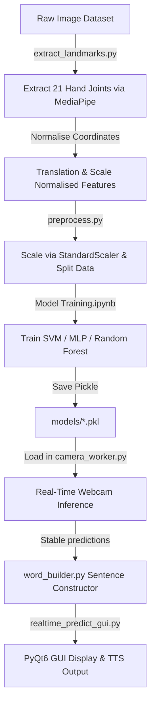

# 🤟 ASL Sign Language Recognition System

A real-time American Sign Language (ASL) translator utilizing computer vision, hand tracking, and machine learning. This project uses **MediaPipe** to extract 3D hand skeleton landmarks, standardizes the features, and classifies gestures in real time using pre-trained machine learning classifiers (SVM, MLP, and Random Forest). It features a modern **PyQt6** GUI with live camera stream visualization, hand skeleton rendering, a customizable word-building buffer, and native Text-to-Speech (TTS) capabilities.

---

## ✨ Features

- **Real-Time Classification**: High-frequency inference (approx. 30 FPS) with low latency.
- **28 Gestures Supported**: Complete A–Z alphabet, plus specialized control signs for **`space`** and **`del`** (delete).
- **Multiple ML Classifiers**: Support for Support Vector Machine (SVM), Multi-Layer Perceptron (MLP), and Random Forest (RF) classifiers, hot-swappable directly within the application.
- **Robust Feature Engineering**: Landmark translation and scale normalization make the recognition resilient to varying hand distances and camera resolutions.
- **Dynamic Word Builder**: Uses a rolling queue buffer and configurable frame cooldown to smooth predictions and accurately construct words and sentences without duplicate triggers.
- **Modern PyQt6 UI/UX**: Styled with a dark glassmorphic interface, custom circular progress rings, status badges, and interactive sliders.
- **Native Text-to-Speech (TTS)**: Converts translated sentences into spoken audio at the click of a button.

---

## 📂 Project Structure

```
CV Project/
├── assets/
│   └── signs.png                 # Sign chart reference displayed in the GUI
├── data/
│   ├── raw/                      # Raw training images organized by directory (e.g., A/, B/, ...)
│   └── landmarks/                # Extracted features and preprocessing assets
│       ├── X.npy / y.npy         # Saved raw landmark arrays
│       ├── X_train.npy / y_test.npy # Train/Test splits
│       ├── label_encoder.pkl     # Encoded class label mappings (28 classes)
│       └── scaler.pkl            # Pre-fitted StandardScaler model
├── models/
│   ├── svm.pkl                   # Trained SVM Model (Default, ~98.4% Acc)
│   ├── mlp.pkl                   # Trained MLP Classifier Model (~98.1% Acc)
│   └── random_forest.pkl         # Trained Random Forest Model (~97.8% Acc)
├── notebooks/
│   └── Model Training.ipynb      # Notebook detailing classifier exploration & evaluation
├── src/
│   ├── camera_worker.py          # QThread managing camera frames, MediaPipe tracking & ML inference
│   ├── extract_landmarks.py      # Extract and normalize landmarks from raw dataset images
│   ├── preprocess.py             # Preprocessing pipeline (scaling, splitting, saving data)
│   ├── realtime_predict_gui.py   # Main PyQt6 interface and layout management
│   └── word_builder.py           # Text buffer and temporal stabilization logic
├── main.py                       # Project entry point
└── requirements.txt              # Project dependencies
```

---

## 🚀 Getting Started

Follow these steps to run the application locally on your machine.

### 1. Prerequisites
Ensure you have **Python 3.8+** installed. Python 3.10 or 3.11 is recommended.

### 2. Set Up Virtual Environment
Clone or navigate to the repository directory, then run:
```bash
# Create a virtual environment
python -m venv venv

# Activate the virtual environment
# On Windows:
venv\Scripts\activate
# On macOS/Linux:
source venv/bin/activate
```

### 3. Install Dependencies
Install all required libraries specified in the `requirements.txt` file:
```bash
pip install -r requirements.txt
```

### 4. Run the Application
Start the real-time prediction GUI:
```bash
python main.py
```

---

## ⚙️ How the Pipeline Works



### Landmark Extraction & Normalization (`src/extract_landmarks.py`)
1. Reads sample images from `data/raw/<class_name>`.
2. Employs MediaPipe Hands to capture coordinates for **21 hand landmark points** in 3D space ($x, y, z$).
3. Normalizes joint offsets:
   - **Translation Normalization**: Shifts all landmarks relative to the wrist ($Landmark_0$ is set to $[0,0,0]$).
   - **Scale Normalization**: Divides coordinates by the maximum Euclidean distance of any joint to the wrist, rendering features immune to camera proximity.
4. Flattens coordinates to a 63-dimensional feature array ($21 \text{ landmarks} \times 3 \text{ axes}$).

### Preprocessing (`src/preprocess.py`)
1. Loads extracted coordinate arrays and splits them 80/20 into training and validation sets.
2. Fits a `StandardScaler` to train sets to normalize features (zero mean, unit variance) and dumps it to `scaler.pkl`.

### Real-Time GUI Application (`main.py` -> `src/realtime_predict_gui.py`)
- Employs a separate worker thread (`QThread`) via `camera_worker.py` to capture frame events asynchronously, keeping the PyQt6 interface responsive and smooth.
- Extracts landmarks dynamically, applies the saved `scaler.pkl` to incoming joint coordinates, and runs inference with the selected model.
- Passes the result through `word_builder.py`, where a rolling buffer counts predictions and updates output text after the threshold cooldown is reached.

---

## 📊 Model Evaluation Results

In the model selection process, three popular supervised classifiers were evaluated on **10,659 samples** (8,527 train, 2,132 test) representing **28 classes** (A-Z, space, delete). 

The comparative metrics achieved in `notebooks/Model Training.ipynb` are:

| Classifier Model | Test Accuracy | Weighted Precision | Weighted Recall | Weighted F1-Score | Training Time (s) |
| :--- | :---: | :---: | :---: | :---: | :---: |
| **Support Vector Machine (SVM)** | **98.41%** | **98.45%** | **98.41%** | **98.41%** | **0.64s** |
| **Multi-Layer Perceptron (MLP)** | 98.08% | 98.14% | 98.08% | 98.09% | 14.24s |
| **Random Forest (RF)** | 97.84% | 97.93% | 97.84% | 97.85% | 24.30s |

> [!TIP]
> The **SVM** model represents the optimal choice. It offers the highest accuracy and outstanding generalization across all 28 classes while training in under a second.

---

## 🎮 Interface & Interactive Controls

The dark-themed dashboard provides intuitive control parameters:
- **Skeleton Visualizer**: Toggles hand skeleton rendering (landmarks and connections) on and off.
- **Active Model Selection**: Swaps classifiers on-the-fly (`camera_worker.py` loads pickle weights dynamically). By default, SVM is selected.
- **Cooldown Slider**: Adjusts target character latency (15 to 60 frames). Higher cooldown values prevent accidental letter insertion from transient hand motions.
- **Circular Progress Ring**: Displays the prediction stability for the current gesture. Once filled, the character is committed to the text box.
- **Text-to-Speech Button**: Reads out the completed sentence.
- **Clear Button**: Wipes the sentence builder text area.

---

## 🛠️ Troubleshooting

#### **Webcam fails to start:**
Ensure no other application (Zoom, Teams, Discord, etc.) is currently using your primary camera index 0. If you have multiple webcams, you can modify `cap = cv2.VideoCapture(0)` in [camera_worker.py](file:///c:/Users/user/OneDrive/Desktop/CV%20Project/src/camera_worker.py#L97) to use indices `1`, `2`, etc.

#### **TTS is disabled (Speak Button is Greyed Out):**
The application relies on PyQt6's native `QtTextToSpeech` library. If it is unavailable on your system (common on older Python installations or specific Linux configurations), you can install the platform-specific TTS package or allow the app to fall back to disabled TTS mode.
